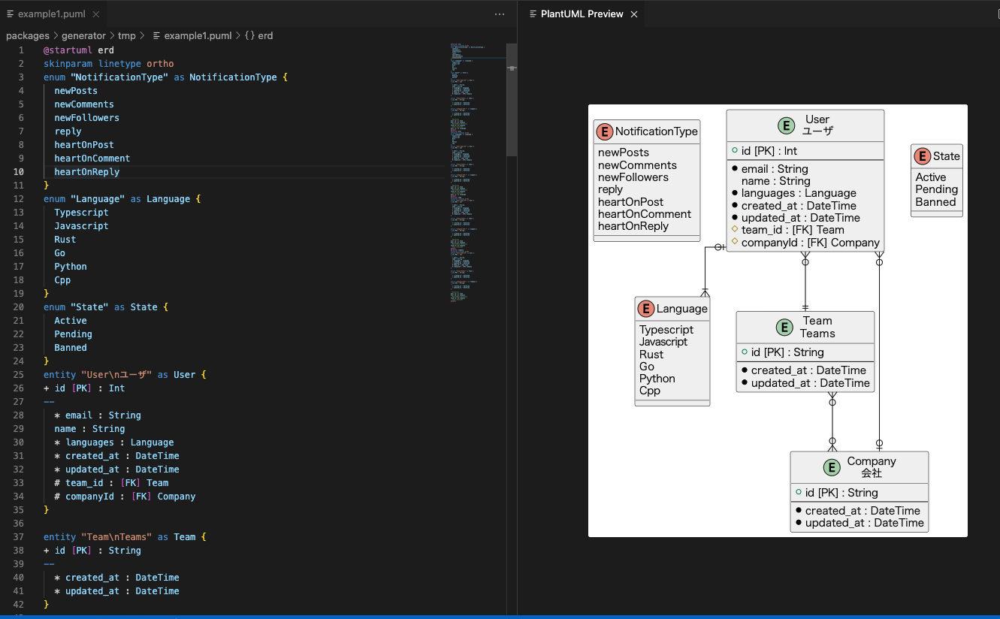

# prisma-generator-plantuml-erd

Prisma generator to create an ER Diagram for plantuml.


You can generate the plantuml source code from the schema.prisma.



# example

- `schema.prisma`
  - https://raw.githubusercontent.com/dbgso/prisma-generator-plantuml-erd/main/packages/usage/prisma/schema.prisma
- generated plantuml file
  - https://raw.githubusercontent.com/dbgso/prisma-generator-plantuml-erd/main/packages/usage/prisma/example.puml
- generated image file
  - https://raw.githubusercontent.com/dbgso/prisma-generator-plantuml-erd/main/packages/usage/prisma/example/erd.svg

# usage


```bash
npm i -D prisma-generator-plantuml-erd
# or
yarn add -D prisma-generator-plantuml-erd
```

Add to your schema.prisma

```prisma
generator erd_plantuml {
  provider   = "prisma-generator-plantuml-erd"
  output = "erd.puml"
}
```

Run the generator

```
$ npx prisma generate
```

# Versions

This generator only support prisma3.
If you use the version greater than 4, this plugin is not work.

# Options

## output

The path of generated plantuml file path.
The default value is './erd.puml'

## usePhysicalTableName

If this flag is true, physical table name is used for name of table on er diagram.
The default value is false;


```
model User {
  id            String         @id

  @map("users")
}
```

If this flag is set to true, then "users" will be displayed on the diagram, otherwise "User" is displayed on the diagram.
 

## exportPerTables

If this flag is true, generate some tables 
If this flag is true, it also generate some diargrams that based on each table.
The diagrams is rendered with only the tables that related with base table.
The default value is false.

example

- all tables
  - https://raw.githubusercontent.com/dbgso/prisma-generator-plantuml-erd/main/packages/usage/prisma/example/erd.svg
- related with User table
  - https://raw.githubusercontent.com/dbgso/prisma-generator-plantuml-erd/main/packages/usage/prisma/example/User.svg
- related with Team table
  - https://raw.githubusercontent.com/dbgso/prisma-generator-plantuml-erd/main/packages/usage/prisma/example/Team.svg
  

## lineLength

You can change the length of relation line by this option.
The default value is '--'.

In the default case

```
Table1 }o--o| Table3
```

if you set this flag to '---'

```
Table1 }o---o| Table3
```

## Example

The example config is here.

```prisma
generator erd_plantuml {
  output: "path/to/output.puml",
  usePhysicalTableName: true,
  lineLength: "---"
  exportPerTables: true
}
```

