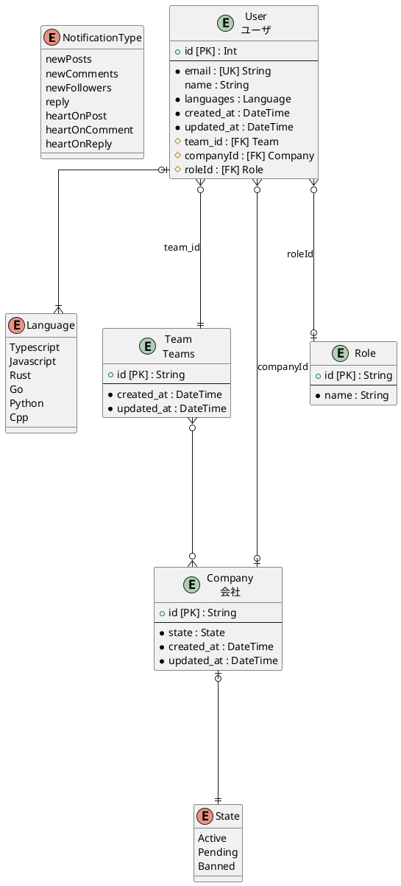
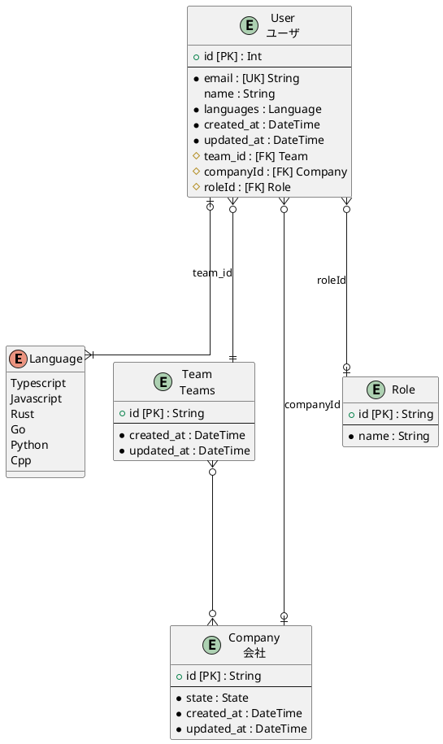
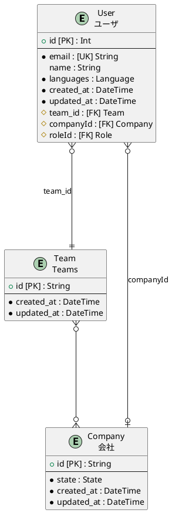
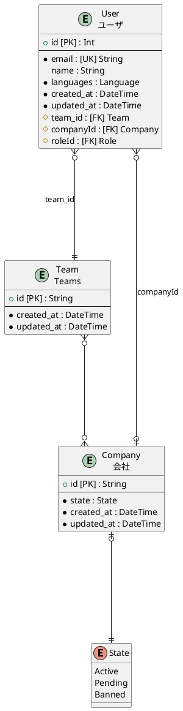
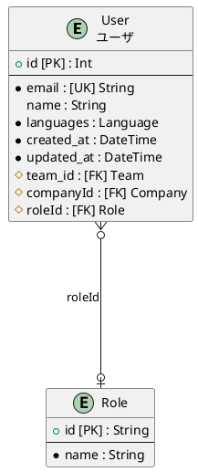

# Tables
- [User](#user)
  - ユーザ
- [Team](#team)
  - Teams
- [Company](#company)
  - 会社
- [Role](#role)

# ER diagram

# User

## Description
ユーザ

## Columns

|Name | Type | Default | Nullable | Unique | Children | Parent | Comment|
|--- | --- | --- | --- | --- | --- | --- | ---|
|id | Int | autoincrement | false | true |  |  | |
|email | String |  | false | true |  |  | |
|name | String |  | true | false |  |  | |
|languages | Language |  | false | false |  |  | |
|created_at | DateTime | now | false | false |  |  | @HideField({ output: false, input: true })|
|updated_at | DateTime |  | false | false |  |  | @HideField({ output: false, input: true })|
|team_id | String |  | false | false |  | [Team](#team) | |
|companyId | String |  | true | false |  | [Company](#company) | |
|roleId | String |  | true | false |  | [Role](#role) | |

# Indexes

|columns | index type | index name|
|--- | --- | ---|
|team_id,companyId | unique | |

## ER diagram

# Team

## Description
Teams

## Columns

|Name | Type | Default | Nullable | Unique | Children | Parent | Comment|
|--- | --- | --- | --- | --- | --- | --- | ---|
|id | String | uuid | false | true | [User](#user), [Company](#company) |  | |
|created_at | DateTime | now | false | false |  |  | @HideField({ output: false, input: true })|
|updated_at | DateTime |  | false | false |  |  | @HideField({ output: false, input: true })|

## ER diagram

# Company

## Description
会社

## Columns

|Name | Type | Default | Nullable | Unique | Children | Parent | Comment|
|--- | --- | --- | --- | --- | --- | --- | ---|
|id | String | uuid | false | true | [User](#user), [Team](#team) |  | |
|state | State |  | false | false |  |  | |
|created_at | DateTime | now | false | false |  |  | @HideField({ output: false, input: true })|
|updated_at | DateTime |  | false | false |  |  | @HideField({ output: false, input: true })|

## ER diagram

# Role

## Description

## Columns

|Name | Type | Default | Nullable | Unique | Children | Parent | Comment|
|--- | --- | --- | --- | --- | --- | --- | ---|
|id | String | uuid | false | true | [User](#user) |  | |
|name | String |  | false | false |  |  | |

## ER diagram

