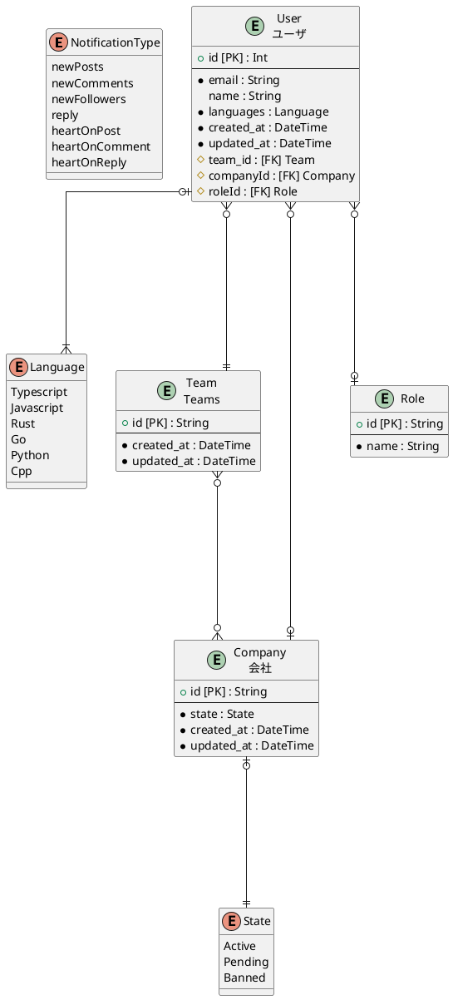
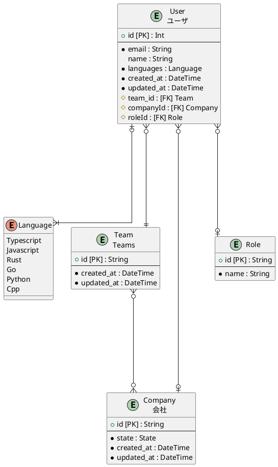
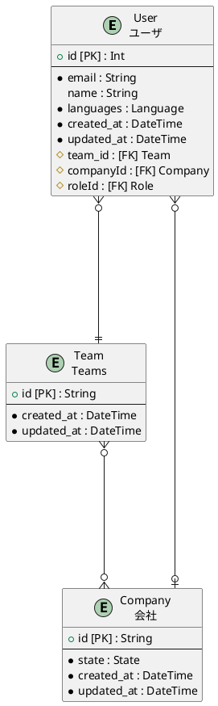
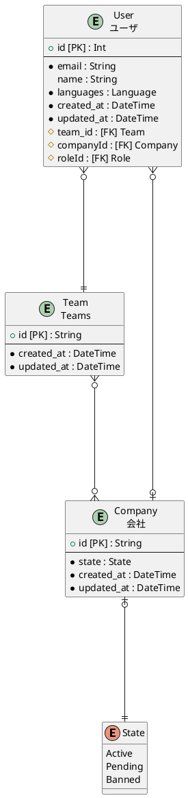
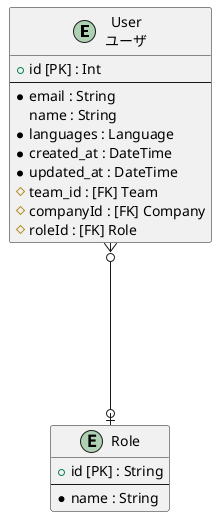

# Tables
- [User](#user)
  - ユーザ
- [Team](#team)
  - Teams
- [Company](#company)
  - 会社
- [Role](#role)

# ER diagram

# User
## Description
ユーザ
## Columns
|Name | Type | Default | Nullable | Children | Parent | Comment|
|--- | --- | --- | --- | --- | --- | ---|
|id | Int | autoincrement | false |  |  | |
|email | String |  | false |  |  | |
|name | String |  | true |  |  | |
|languages | Language |  | false |  |  | |
|created_at | DateTime | now | false |  |  | @HideField({ output: false, input: true })|
|updated_at | DateTime |  | false |  |  | @HideField({ output: false, input: true })|
|team_id | String |  | false |  | [Team](#team) | |
|companyId | String |  | true |  | [Company](#company) | |
|roleId | String |  | true |  | [Role](#role) | |

## ER diagram

# Team
## Description
Teams
## Columns
|Name | Type | Default | Nullable | Children | Parent | Comment|
|--- | --- | --- | --- | --- | --- | ---|
|id | String | uuid | false | [User](#user), [Company](#company) |  | |
|created_at | DateTime | now | false |  |  | @HideField({ output: false, input: true })|
|updated_at | DateTime |  | false |  |  | @HideField({ output: false, input: true })|

## ER diagram

# Company
## Description
会社
## Columns
|Name | Type | Default | Nullable | Children | Parent | Comment|
|--- | --- | --- | --- | --- | --- | ---|
|id | String | uuid | false | [User](#user), [Team](#team) |  | |
|state | State |  | false |  |  | |
|created_at | DateTime | now | false |  |  | @HideField({ output: false, input: true })|
|updated_at | DateTime |  | false |  |  | @HideField({ output: false, input: true })|

## ER diagram

# Role
## Description

## Columns
|Name | Type | Default | Nullable | Children | Parent | Comment|
|--- | --- | --- | --- | --- | --- | ---|
|id | String | uuid | false | [User](#user) |  | |
|name | String |  | false |  |  | |

## ER diagram
